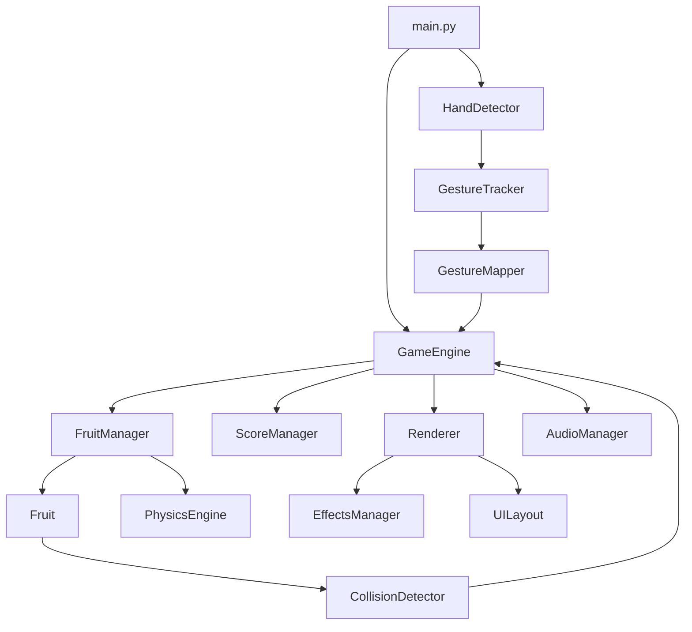

# 基于MediaPipe的水果忍者游戏项目架构

## 1. 项目概述

本项目是一款基于MediaPipe手势识别的水果忍者游戏，使用Python技术栈开发。玩家通过摄像头捕捉手部动作，在屏幕上切割水果获得分数，体验类似经典水果忍者游戏的玩法。

## 2. 技术栈

| 类别 | 技术/库 | 版本 | 用途 |
|------|---------|------|------|
| 编程语言 | Python | 3.8+ | 核心开发语言 |
| 手势识别 | MediaPipe Hands | 最新版 | 手部关键点检测与手势识别 |
| 图形渲染 | PyGame | 2.1.0+ | 游戏界面渲染与动画效果 |
| 摄像头捕获 | OpenCV | 4.5.0+ | 摄像头视频流捕获与图像处理 |
| 数学计算 | NumPy | 1.20.0+ | 数学运算与数据处理 |
| 包管理 | pip | 最新版 | 依赖包管理 |
| 开发环境 | VS Code / PyCharm | 最新版 | 代码编辑与调试 |

## 3. 项目目录结构

```
FruitNinja/
├── src/                   # 源代码目录
│   ├── audio/             # 音频模块
│   │   ├── __init__.py     # 模块初始化文件
│   │   ├── manager.py      # 音频管理器
│   │   └── feedback.py     # 游戏反馈机制
│   ├── game/              # 游戏核心模块
│   │   ├── __init__.py     # 模块初始化文件
│   │   ├── engine.py       # 游戏引擎与主循环
│   │   ├── fruit.py        # 水果对象定义与管理
│   │   ├── physics.py      # 物理系统与运动模拟
│   │   ├── collision.py    # 碰撞检测系统
│   │   ├── score.py        # 计分系统与游戏状态
│   │   ├── config.py       # 游戏配置参数
│   │   └── factory.py      # 游戏模块工厂
│   ├── gesture/           # 手势识别模块
│   │   ├── __init__.py     # 模块初始化文件
│   │   ├── detector.py     # MediaPipe Hands集成与手部检测
│   │   ├── tracker.py      # 手势轨迹跟踪与分析
│   │   └── mapper.py       # 手势与游戏操作映射
│   ├── ui/                # 界面模块
│   │   ├── __init__.py     # 模块初始化文件
│   │   ├── renderer.py     # PyGame渲染器
│   │   ├── effects.py      # 视觉效果与粒子系统
│   │   └── layout.py       # 界面布局与元素
│   └── utils/             # 工具模块
│       ├── __init__.py     # 模块初始化文件
│       ├── camera.py       # 摄像头工具
│       ├── logger.py       # 日志工具
│       └── timer.py        # 计时器工具
├── main.py                # 游戏主入口文件
├── requirements.txt       # 项目依赖文件
├── README.md              # 项目说明文档
└── 项目架构.md             # 架构设计文档
```

## 4. 核心模块功能

### 4.1 音频模块 (`src/audio/`)
- **音频管理器**：初始化音频系统，管理音频资源的加载和释放
- **游戏反馈机制**：根据游戏事件生成相应的音频反馈

### 4.2 游戏核心模块 (`src/game/`)
- **游戏引擎**：管理游戏主循环，协调各模块工作，处理游戏状态
- **水果对象**：定义水果类，管理水果的属性和行为
- **物理系统**：模拟水果的运动，包括抛物线轨迹和旋转
- **碰撞检测**：检测手势与水果的碰撞，判断是否切割成功
- **计分系统**：管理游戏分数，处理游戏状态变化
- **游戏配置**：存储游戏的配置参数，如水果生成频率、速度等
- **游戏模块工厂**：创建和管理游戏中的各种模块

### 4.3 手势识别模块 (`src/gesture/`)
- **手部检测**：初始化MediaPipe Hands，处理摄像头输入，检测手部关键点
- **手势轨迹跟踪**：跟踪手部关键点的运动轨迹，分析运动速度和方向
- **手势与操作映射**：将手部动作映射到游戏操作，识别挥砍动作

### 4.4 界面模块 (`src/ui/`)
- **渲染器**：负责游戏界面的绘制，包括水果、分数、特效等
- **视觉效果**：实现水果切割的特效，如爆炸、粒子效果等
- **界面布局**：管理游戏界面的布局，如分数显示、生命值等

### 4.5 工具模块 (`src/utils/`)
- **摄像头工具**：管理摄像头的初始化和视频流捕获
- **日志工具**：记录游戏运行过程中的日志信息
- **计时器工具**：提供游戏中的计时功能

## 5. 核心类设计

### 5.1 音频模块核心类
- **`AudioManager`**：管理整个音频系统，包括音效和背景音乐

### 5.2 游戏核心模块核心类
- **`GameEngine`**：游戏主引擎，管理游戏主循环和状态
- **`Fruit`**：水果对象，定义水果的属性和行为
- **`FruitManager`**：管理水果的生成、更新和移除
- **`PhysicsEngine`**：物理系统，模拟水果的运动
- **`CollisionDetector`**：碰撞检测，检测手势与水果的碰撞
- **`ScoreManager`**：计分系统，管理游戏分数和状态
- **`GameFactory`**：游戏模块工厂，创建和管理游戏模块

### 5.3 手势识别模块核心类
- **`HandDetector`**：手部检测器，使用MediaPipe Hands检测手部关键点
- **`GestureTracker`**：手势跟踪器，跟踪手部运动轨迹
- **`GestureMapper`**：手势映射器，将手部动作映射到游戏操作

### 5.4 界面模块核心类
- **`Renderer`**：渲染器，负责游戏界面的绘制
- **`EffectsManager`**：特效管理器，管理视觉特效
- **`UILayout`**：界面布局管理器，管理UI元素的位置和样式

### 5.5 工具模块核心类
- **`Camera`**：摄像头工具，管理摄像头的初始化和视频流捕获
- **`Logger`**：日志工具，记录游戏运行过程中的日志信息
- **`Timer`**：计时器工具，提供游戏中的计时功能

## 6. 模块依赖关系



## 7. 游戏主循环流程

1. **初始化阶段**：
   - 初始化游戏引擎、手势识别系统、渲染器、音频管理器等
   - 加载游戏资源（图片、音效等）
   - 设置游戏初始状态

2. **游戏循环**：
   - **输入处理**：通过摄像头捕获手部动作，使用MediaPipe Hands检测手部关键点
   - **手势分析**：跟踪手部运动轨迹，识别挥砍动作
   - **游戏逻辑更新**：
     - 更新水果位置和状态
     - 检测手势与水果的碰撞
     - 更新游戏分数和生命值
   - **渲染**：
     - 绘制水果
     - 绘制特效（如切割效果）
     - 绘制UI元素（分数、生命值等）
   - **音频处理**：播放游戏音效和背景音乐

3. **结束阶段**：
   - 处理游戏结束逻辑
   - 释放资源
   - 关闭摄像头

## 8. 关键技术实现

### 8.1 手势识别实现
- 使用MediaPipe Hands检测21个手部关键点
- 结合OpenCV进行摄像头捕获和图像处理
- 实现手部运动轨迹分析，通过计算关键点的位移和速度来识别挥砍动作
- 使用滑动窗口技术平滑手势轨迹，提高识别准确性

### 8.2 游戏物理实现
- 使用简单的物理模型模拟水果的抛物线运动
- 实现水果的旋转效果，增强视觉真实感
- 设计碰撞检测算法，判断手势轨迹是否与水果相交
- 优化物理计算，确保游戏在实时运行时的流畅性

### 8.3 视觉效果实现
- 使用PyGame的渲染系统绘制游戏元素
- 实现水果切割的粒子特效，包括颜色渐变和透明度变化
- 设计UI界面，包括分数显示、生命值显示、游戏状态提示等
- 优化渲染性能，使用双缓冲技术减少画面闪烁

### 8.4 音频系统实现
- 使用PyGame的mixer模块管理音频
- 实现音效的加载和播放，包括切割水果、游戏开始、游戏结束等音效
- 设计音频反馈机制，根据游戏事件播放相应的音效
- 支持背景音乐的循环播放和音量控制

## 9. 性能优化策略

1. **多线程处理**：
   - 使用多线程分离手势识别和游戏逻辑，提高响应速度
   - 手势识别在单独线程中运行，避免阻塞游戏主循环

2. **资源管理**：
   - 预加载游戏资源，减少运行时加载时间
   - 合理管理内存，及时释放不再使用的资源

3. **计算优化**：
   - 使用NumPy进行数学计算，提高计算效率
   - 减少不必要的计算，如只在需要时进行碰撞检测

4. **渲染优化**：
   - 使用PyGame的Surface缓存减少绘制操作
   - 实现视口裁剪，只渲染可见区域的对象

5. **手势识别优化**：
   - 调整MediaPipe Hands的检测参数，平衡准确性和性能
   - 使用降采样技术减少图像处理的计算量

## 10. 扩展性设计

### 10.1 模块化设计
- 各模块之间通过明确的接口进行通信，便于扩展和修改
- 使用抽象基类定义模块接口，支持不同实现

### 10.2 配置系统
- 使用配置文件存储游戏参数，便于调整游戏难度和特性
- 支持运行时修改配置，实时调整游戏行为

### 10.3 插件系统
- 设计插件接口，支持添加新的游戏模式和功能
- 支持自定义水果类型、特效和音效

### 10.4 跨平台支持
- 使用平台无关的库和API，确保游戏在不同平台上运行
- 处理平台差异，如摄像头设备的不同

## 11. 风险评估

| 风险 | 描述 | 影响 | 缓解措施 |
|------|------|------|----------|
| 手势识别准确性 | MediaPipe Hands在复杂环境下可能识别不准确 | 游戏体验下降 | 优化光线条件，调整MediaPipe参数，增加手势识别的容错性 |
| 性能问题 | 手势识别和游戏物理计算可能导致性能下降 | 游戏卡顿 | 使用多线程处理，优化计算算法，减少不必要的渲染 |
| 跨平台兼容性 | 不同平台的摄像头和硬件差异可能导致问题 | 部分平台无法运行 | 使用平台无关的库，增加平台检测和适配代码 |
| 资源加载失败 | 图片或音效资源加载失败 | 游戏功能缺失 | 添加资源加载错误处理，提供默认资源 |
| 游戏平衡性 | 游戏难度可能过高或过低 | 玩家体验不佳 | 提供难度设置选项，根据玩家反馈调整游戏参数 |

## 12. 总结

本项目架构设计遵循模块化、可扩展性和性能优化的原则，使用Python技术栈实现了一款基于MediaPipe手势识别的水果忍者游戏。通过明确的模块划分和职责分配，确保了代码的可维护性和可扩展性。同时，通过多线程处理和优化算法，确保了游戏的流畅运行。

项目架构充分考虑了手势识别、游戏物理、视觉效果和音频处理等关键技术点，为开发团队提供了清晰的技术路线和实现指南。通过遵循本架构设计，开发团队可以高效地实现游戏功能，为玩家提供流畅、有趣的游戏体验。