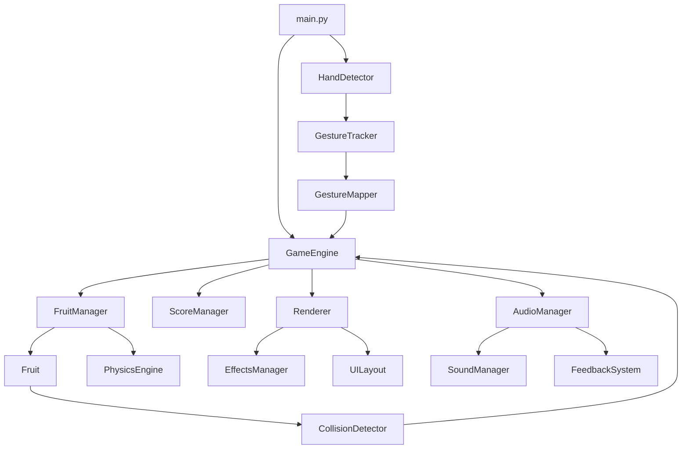

# 基于MediaPipe的水果忍者游戏项目架构

## 1. 项目概述

本项目是一款基于MediaPipe手势识别的水果忍者游戏，使用Python技术栈开发。玩家通过摄像头捕捉手部动作，在屏幕上切割水果获得分数，体验类似经典水果忍者游戏的玩法。

## 2. 技术栈

| 类别 | 技术/库 | 版本 | 用途 |
|------|---------|------|------|
| 编程语言 | Python | 3.8+ | 核心开发语言 |
| 手势识别 | MediaPipe Hands | 最新版 | 手部关键点检测与手势识别 |
| 图形渲染 | PyGame | 2.1.0+ | 游戏界面渲染与动画效果 |
| 摄像头捕获 | OpenCV | 4.5.0+ | 摄像头视频流捕获与图像处理 |
| 数学计算 | NumPy | 1.20.0+ | 数学运算与数据处理 |
| 包管理 | pip | 最新版 | 依赖包管理 |
| 开发环境 | VS Code / PyCharm | 最新版 | 代码编辑与调试 |

## 3. 项目目录结构

```
fruit-ninja/
├── main.py                # 游戏主入口文件
├── requirements.txt       # 项目依赖文件
├── README.md              # 项目说明文档
├── assets/                # 静态资源目录
│   ├── images/            # 图片资源
│   │   ├── fruits/        # 水果图片
│   │   ├── backgrounds/   # 背景图片
│   │   └── icons/         # 图标图片
│   └── sounds/            # 音频资源
│       ├── effects/       # 音效文件
│       └── music/         # 背景音乐
└── src/                   # 源代码目录
    ├── gesture/           # 手势识别模块
    │   ├── __init__.py     # 模块初始化文件
    │   ├── detector.py     # MediaPipe Hands集成与手部检测
    │   ├── tracker.py      # 手势轨迹跟踪与分析
    │   └── mapper.py       # 手势与游戏操作映射
    ├── game/              # 游戏核心模块
    │   ├── __init__.py     # 模块初始化文件
    │   ├── engine.py       # 游戏引擎与主循环
    │   ├── fruit.py        # 水果对象定义与管理
    │   ├── physics.py      # 物理系统与运动模拟
    │   ├── collision.py    # 碰撞检测系统
    │   ├── score.py        # 计分系统与游戏状态
    │   └── config.py       # 游戏配置参数
    ├── ui/                # 界面模块
    │   ├── __init__.py     # 模块初始化文件
    │   ├── renderer.py     # PyGame渲染器
    │   ├── effects.py      # 视觉效果与粒子系统
    │   ├── layout.py       # 界面布局与元素
    │   └── fonts.py        # 字体管理
    ├── audio/             # 音频模块
    │   ├── __init__.py     # 模块初始化文件
    │   ├── manager.py      # 音频管理器
    │   ├── sounds.py       # 音效定义与播放
    │   └── feedback.py     # 游戏反馈机制
    └── utils/             # 工具模块
        ├── __init__.py     # 模块初始化文件
        ├── camera.py       # 摄像头工具
        ├── timer.py        # 计时器工具
        └── logger.py       # 日志工具
```

## 4. 模块功能与职责

### 4.1 手势识别模块 (`src/gesture/`)

| 模块 | 功能描述 | 主要职责 | 关键类/函数 |
|------|----------|----------|-------------|
| detector.py | MediaPipe Hands集成 | 初始化MediaPipe Hands，处理摄像头输入，检测手部关键点 | `HandDetector`类、`detect_hands()`方法 |
| tracker.py | 手势轨迹跟踪 | 跟踪手部关键点的运动轨迹，分析运动速度和方向 | `GestureTracker`类、`track_movement()`方法 |
| mapper.py | 手势与操作映射 | 将手部动作映射到游戏操作，识别挥砍动作 | `GestureMapper`类、`map_gesture_to_action()`方法 |

### 4.2 游戏核心模块 (`src/game/`)

| 模块 | 功能描述 | 主要职责 | 关键类/函数 |
|------|----------|----------|-------------|
| engine.py | 游戏引擎 | 管理游戏主循环，协调各模块工作，处理游戏状态 | `GameEngine`类、`run()`方法 |
| fruit.py | 水果对象 | 定义水果类，管理水果的属性和行为 | `Fruit`类、`update()`方法 |
| physics.py | 物理系统 | 模拟水果的运动，包括抛物线轨迹和旋转 | `PhysicsEngine`类、`apply_physics()`方法 |
| collision.py | 碰撞检测 | 检测手势与水果的碰撞，判断是否切割成功 | `CollisionDetector`类、`detect_collision()`方法 |
| score.py | 计分系统 | 管理游戏分数，处理游戏状态变化 | `ScoreManager`类、`update_score()`方法 |
| config.py | 游戏配置 | 存储游戏的配置参数，如水果生成频率、速度等 | 配置常量和`GameConfig`类 |

### 4.3 界面模块 (`src/ui/`)

| 模块 | 功能描述 | 主要职责 | 关键类/函数 |
|------|----------|----------|-------------|
| renderer.py | 渲染器 | 负责游戏界面的绘制，包括水果、分数、特效等 | `Renderer`类、`render()`方法 |
| effects.py | 视觉效果 | 实现水果切割的特效，如爆炸、粒子效果等 | `EffectsManager`类、`create_explosion()`方法 |
| layout.py | 界面布局 | 管理游戏界面的布局，如分数显示、生命值等 | `UILayout`类、`draw_ui_elements()`方法 |
| fonts.py | 字体管理 | 加载和管理游戏中使用的字体 | `FontManager`类、`get_font()`方法 |

### 4.4 音频模块 (`src/audio/`)

| 模块 | 功能描述 | 主要职责 | 关键类/函数 |
|------|----------|----------|-------------|
| manager.py | 音频管理器 | 初始化音频系统，管理音频资源的加载和释放 | `AudioManager`类、`init()`方法 |
| sounds.py | 音效管理 | 定义和播放游戏中的各种音效 | `SoundManager`类、`play_sound()`方法 |
| feedback.py | 游戏反馈 | 根据游戏事件生成相应的音频反馈 | `FeedbackSystem`类、`process_event()`方法 |

### 4.5 工具模块 (`src/utils/`)

| 模块 | 功能描述 | 主要职责 | 关键类/函数 |
|------|----------|----------|-------------|
| camera.py | 摄像头工具 | 管理摄像头的初始化和视频流捕获 | `Camera`类、`get_frame()`方法 |
| timer.py | 计时器工具 | 提供游戏中的计时功能 | `Timer`类、`get_elapsed()`方法 |
| logger.py | 日志工具 | 记录游戏运行过程中的日志信息 | `Logger`类、`log()`方法 |

## 5. 核心类设计

### 5.1 核心类概述

#### 手势识别相关类
- **`HandDetector`**：MediaPipe Hands集成，负责手部关键点检测
- **`GestureTracker`**：跟踪手部运动轨迹，分析运动速度和方向
- **`GestureMapper`**：将手部动作映射到游戏操作，识别挥砍动作

#### 游戏核心相关类
- **`GameEngine`**：管理游戏主循环，协调各模块工作，处理游戏状态
- **`Fruit`**：定义水果属性和行为
- **`FruitManager`**：管理水果的生成、更新和移除
- **`PhysicsEngine`**：模拟水果的运动，包括抛物线轨迹和旋转
- **`CollisionDetector`**：检测手势与水果的碰撞
- **`ScoreManager`**：管理游戏分数和状态

#### 界面相关类
- **`Renderer`**：负责游戏界面的绘制
- **`EffectsManager`**：管理视觉特效
- **`UILayout`**：管理游戏界面的布局

### 5.2 关键类详细设计

#### 核心模块（保持详细设计）
- **`GameEngine`**：游戏主引擎，管理整个游戏流程
- **`HandDetector`**：手势识别核心，处理摄像头输入和手部检测
- **`PhysicsEngine`**：物理系统，影响游戏体验的关键模块
- **`CollisionDetector`**：碰撞检测，影响游戏核心玩法

#### 非核心模块（简化设计）
- **`EffectsManager`**：特效系统，允许自由扩展特效类型
- **`SoundManager`**：音效管理，允许自定义音效实现
- **`UILayout`**：界面布局，允许调整UI元素位置和样式

## 6. 设计决策记录

### 6.1 核心架构决策

| 决策 | 原因 | 影响 |
|------|------|------|
| 采用模块化设计 | 提高代码可维护性和可扩展性 | 增加了一定的架构复杂度 |
| 手势识别与游戏逻辑分离 | 便于单独优化和测试 | 增加了模块间通信开销 |
| 物理系统独立实现 | 确保游戏物理效果的一致性 | 增加了代码量 |
| 渲染与游戏逻辑分离 | 便于优化渲染性能 | 增加了数据同步复杂度 |

### 6.2 可扩展点设计

| 扩展点 | 描述 | 推荐扩展方式 |
|--------|------|--------------|
| 水果类型 | 支持添加新的水果类型 | 扩展`Fruit`类或修改水果配置 |
| 特效系统 | 支持添加新的视觉特效 | 扩展`EffectsManager`类，添加新特效类型 |
| 音效系统 | 支持添加新的音效 | 修改`SoundManager`，添加新音效文件 |
| 游戏模式 | 支持添加新的游戏模式 | 扩展`GameEngine`，添加新游戏状态和逻辑 |
| 手势识别 | 支持改进手势识别算法 | 扩展`GestureMapper`类，调整识别逻辑 |
| UI界面 | 支持自定义UI样式和布局 | 修改`UILayout`类，调整UI元素 |

## 7. 模块依赖关系



## 8. 数据流与控制流

### 8.1 游戏主循环流程

1. **初始化阶段**：
   - 初始化游戏引擎、手势识别系统、渲染器、音频管理器等
   - 加载游戏资源（图片、音效等）
   - 设置游戏初始状态

2. **游戏循环**：
   - **输入处理**：通过摄像头捕获手部动作，使用MediaPipe Hands检测手部关键点
   - **手势分析**：跟踪手部运动轨迹，识别挥砍动作
   - **游戏逻辑更新**：
     - 更新水果位置和状态
     - 检测手势与水果的碰撞
     - 更新游戏分数和生命值
   - **渲染**：
     - 绘制水果
     - 绘制特效（如切割效果）
     - 绘制UI元素（分数、生命值等）
   - **音频处理**：播放游戏音效和背景音乐

3. **结束阶段**：
   - 处理游戏结束逻辑
   - 释放资源
   - 关闭摄像头

### 8.2 手势识别与游戏交互流程

1. **摄像头捕获**：使用OpenCV捕获摄像头视频流
2. **手部检测**：使用MediaPipe Hands检测手部关键点
3. **轨迹跟踪**：跟踪手部运动轨迹，计算运动速度和方向
4. **手势识别**：识别挥砍动作，判断切割方向和力度
5. **碰撞检测**：检测手势轨迹与水果的碰撞
6. **游戏反馈**：
   - 标记水果为已切割
   - 增加游戏分数
   - 播放切割音效
   - 显示切割特效

## 9. 关键技术实现

### 9.1 手势识别实现
- 使用MediaPipe Hands检测21个手部关键点
- 结合OpenCV进行摄像头捕获和图像处理
- 实现手部运动轨迹分析，通过计算关键点的位移和速度来识别挥砍动作
- 使用滑动窗口技术平滑手势轨迹，提高识别准确性

### 9.2 游戏物理实现
- 使用简单的物理模型模拟水果的抛物线运动
- 实现水果的旋转效果，增强视觉真实感
- 设计碰撞检测算法，判断手势轨迹是否与水果相交
- 优化物理计算，确保游戏在实时运行时的流畅性

### 9.3 视觉效果实现
- 使用PyGame的Sprite系统管理游戏对象
- 实现水果切割的粒子特效，包括颜色渐变和透明度变化
- 设计UI界面，包括分数显示、生命值显示、游戏状态提示等
- 优化渲染性能，使用双缓冲技术减少画面闪烁

### 9.4 音频系统实现
- 使用PyGame的mixer模块管理音频
- 实现音效的加载和播放，包括切割水果、游戏开始、游戏结束等音效
- 设计音频反馈机制，根据游戏事件播放相应的音效
- 支持背景音乐的循环播放和音量控制

## 10. 性能优化策略

1. **多线程处理**：
   - 使用多线程分离手势识别和游戏逻辑，提高响应速度
   - 手势识别在单独线程中运行，避免阻塞游戏主循环

2. **资源管理**：
   - 预加载游戏资源，减少运行时加载时间
   - 合理管理内存，及时释放不再使用的资源

3. **计算优化**：
   - 使用NumPy进行数学计算，提高计算效率
   - 减少不必要的计算，如只在需要时进行碰撞检测

4. **渲染优化**：
   - 使用PyGame的Surface缓存减少绘制操作
   - 实现视口裁剪，只渲染可见区域的对象

5. **手势识别优化**：
   - 调整MediaPipe Hands的检测参数，平衡准确性和性能
   - 使用降采样技术减少图像处理的计算量

## 11. 扩展性设计

### 11.1 模块化设计
- 各模块之间通过明确的接口进行通信，便于扩展和修改
- 使用抽象基类定义模块接口，支持不同实现

### 11.2 配置系统
- 使用配置文件存储游戏参数，便于调整游戏难度和特性
- 支持运行时修改配置，实时调整游戏行为

### 11.3 插件系统
- 设计插件接口，支持添加新的游戏模式和功能
- 支持自定义水果类型、特效和音效

### 11.4 跨平台支持
- 使用平台无关的库和API，确保游戏在不同平台上运行
- 处理平台差异，如摄像头设备的不同

### 11.5 推荐扩展方式

#### 特效系统扩展
1. 在`EffectsManager`中添加新的特效创建方法
2. 定义新的特效类，实现`update()`和`draw()`方法
3. 在游戏中调用新的特效创建方法

#### 音效系统扩展
1. 在`sounds`目录中添加新的音效文件
2. 在`SoundManager`中注册新的音效
3. 在游戏事件中播放新的音效

#### 游戏模式扩展
1. 在`GameEngine`中添加新的游戏状态
2. 实现新游戏模式的逻辑
3. 添加相应的UI界面和音效

## 12. 测试策略

1. **单元测试**：
   - 为核心模块编写单元测试，确保功能正常
   - 使用pytest框架进行测试自动化

2. **集成测试**：
   - 测试模块之间的集成，确保数据流通畅
   - 测试完整的游戏流程，确保游戏可以正常运行

3. **性能测试**：
   - 测试游戏在不同硬件配置下的性能
   - 分析帧率和响应时间，找出性能瓶颈

4. **用户测试**：
   - 邀请用户参与测试，收集反馈意见
   - 根据用户反馈调整游戏难度和体验

## 13. 部署与发布

1. **依赖管理**：
   - 使用requirements.txt文件记录项目依赖
   - 提供安装脚本，简化环境配置

2. **打包发布**：
   - 使用PyInstaller或cx_Freeze将游戏打包为可执行文件
   - 提供Windows、macOS和Linux平台的安装包

3. **文档**：
   - 提供详细的安装和使用说明
   - 编写开发者文档，便于后续维护和扩展

## 14. 项目管理

1. **版本控制**：
   - 使用Git进行版本控制
   - 遵循Git Flow工作流，管理代码分支

2. **任务管理**：
   - 使用GitHub Issues或Trello管理开发任务
   - 定期召开团队会议，讨论项目进展

3. **代码规范**：
   - 遵循PEP 8代码规范
   - 使用Black或Flake8进行代码格式化和检查

4. **文档管理**：
   - 使用Markdown编写项目文档
   - 定期更新文档，确保文档与代码同步

## 15. 风险评估

| 风险 | 描述 | 影响 | 缓解措施 |
|------|------|------|----------|
| 手势识别准确性 | MediaPipe Hands在复杂环境下可能识别不准确 | 游戏体验下降 | 优化光线条件，调整MediaPipe参数，增加手势识别的容错性 |
| 性能问题 | 手势识别和游戏物理计算可能导致性能下降 | 游戏卡顿 | 使用多线程处理，优化计算算法，减少不必要的渲染 |
| 跨平台兼容性 | 不同平台的摄像头和硬件差异可能导致问题 | 部分平台无法运行 | 使用平台无关的库，增加平台检测和适配代码 |
| 资源加载失败 | 图片或音效资源加载失败 | 游戏功能缺失 | 添加资源加载错误处理，提供默认资源 |
| 游戏平衡性 | 游戏难度可能过高或过低 | 玩家体验不佳 | 提供难度设置选项，根据玩家反馈调整游戏参数 |

## 16. 架构回退说明

### 16.1 回退原因
- 减少过于详细的架构约束，增加团队成员的创新空间
- 降低新成员的学习成本，提高快速上手能力
- 增强项目的灵活性，便于快速迭代和调整
- 平衡架构稳定性和开发效率

### 16.2 回退措施
- **简化文档**：减少过于详细的实现细节文档，保留核心架构信息
- **放宽非核心模块约束**：允许在非核心模块上有更多的实现自由度
- **引入架构守护者角色**：负责监督核心架构，而非强制所有决策
- **建立快速原型机制**：允许团队成员创建实验性实现，验证想法
- **增强团队参与**：让团队成员负责特定模块的设计和实现

### 16.3 预期效果
- **团队参与度提高**：团队成员有更多发挥空间，增加创新动力
- **开发效率提升**：减少不必要的架构约束，加快开发速度
- **灵活性增强**：游戏项目能够快速迭代和调整
- **学习成本降低**：新成员能够更快上手，理解核心架构
- **代码质量保持**：通过核心模块的稳定性和审查机制，确保整体代码质量